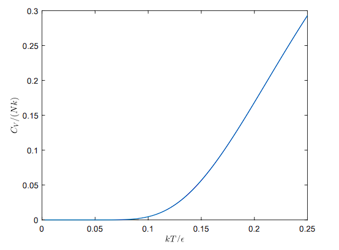

[HOME](/source/index.rst)

(muleinstein)=
# Multiple Einstein Solids

```{note}
for two solids with N oscillators and q energy units in total, there are 
$q + 1$ macrostates since the number of energy units in Einstein solid A can be
any integer from 0 to q

There are $\Omega$ microstates

$$
\Omega = \binom{q_{tot} + N_{tot} - 1}{q_{tot}}
$$
```

The module [EinsteinSolids.py](/SttPhscsPckg/EinsteinSolids.py) prints out a nice answer for almost every possible numerical problem of einstein solids

- "An introduction to thermal physics" by Daniel Schröeder, pp. 74-77
- AnswersC.pdf problem 2.30
  - The appropriate approximations should be considered.
  - if given approximations, write the logarithms out, so python can handle the numbers.

## Limit of $q \ll N$

When finding a formula for the temperature of an Einstein solid refer to AnswersC.pdf
problem 3.5 which also solves for the energy to give:

$$U = N \epsilon \cdot e^{\frac{-\epsilon}{k T}}$$

Calculating the heat capacity of an Einstein solid please refer to 'AnswersC.pdf'
which tells that it is calculated by:

$$
C_V = \left( \frac{\partial U}{\partial T} \right)_{V,N}
= \frac{N \epsilon^2}{k T^2} \cdot e^{-\epsilon/(k T)}
$$

it could also be written as:

$$
\frac{C_V}{Nk} = \frac{1}{\left(kT / \epsilon \right)^2} e^{-1 / (kT)}
$$

A sketch of the heat capacity can look like this:



