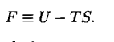
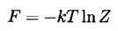
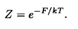
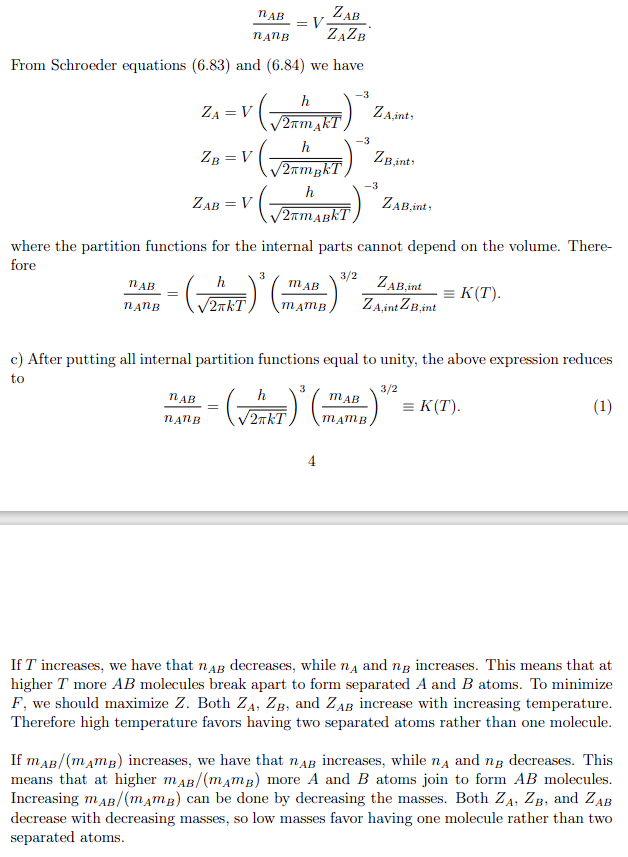

[HOME](/source/index.rst)

(energyidgas)=
# Energy

```{note} Different kinds of energy
:name: nrgnsmbl

Entropy: 

Helmholtz Free energy:

```

(energiesidgas)=
## Entropy

```{note} The entropy relation to heat imput
All of the following is for the quasistatic isothermal expansion

```

Use 'AnswerC.pdf' problem 2.34 when deriving $\Delta S = \frac{Q}{T}$
for an isothermal process with U fixed.

Use 'AnswerC.pdf' problem 3.25 when:

- deriving an expression for he entropy of
an Einstein solid as a function of N and q(where N is number of oscillators and
q is number of energy units).
- calculating the temperature of an Einstein solid as a function of its energy
- deriving an equation for the heat capacity, by using the energy as a function of temperature.
- Checking the limits of heat capacity at $T \rightarrow \infin$.
- showing a graph of heat capacity as a function of T:

![Alt text][def7]

[def7]: ../figs/image-4.png

### Helmholtz free energy and ideal gas

When working with Helmholtz please please please....just give up...:

  
*definition of the free energy*

  
*Giant leap to this clusion. Book says intuitive... i don't think so...*

  
*Also this, from the* ''intuitive leap''

Also some references:

- "An introduction to thermal physics" by Daniel Schröeder, pp. 251-255
- **'ProblemsE.pdf' and 'AnswersE.pdf' problem E2**

Remember that the partition functions oftentimes are not written, and $Z_i$ is just a placeholder in the problem until given the actual function. This is true for Ideal Gasses at least.

If you are ver very doven just use te function 

`symbolic_F_free_energy(num_particles = 1, stirling_approx = True)`{l=python}

from the module `PartitionFunctions`.  
Just remember that the number of particles is not the number of different atoms, but particles as a whole. that means for two atoms A and B creating a molecule AB thhe number of particles is now three and not two. If ou are only interested in the free energy as a function of PF set `stirling_approx = False` to get the precise energy. if this function is displayed using a $\Gamma$ function remember that $\Gamma (n+1) = n!$

:::{figure} ../../../figures/Partitionfunctions/image-9.png



taken from [course material](../../../courseMaterial/Problems/Solutions/AnswersE.pdf)
:::
