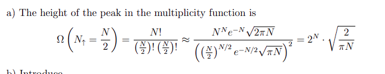
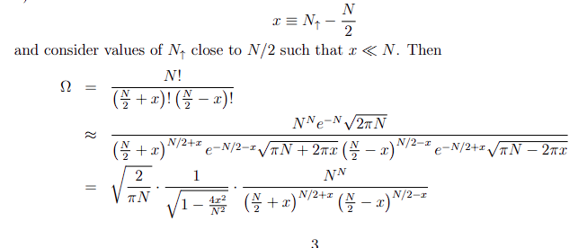
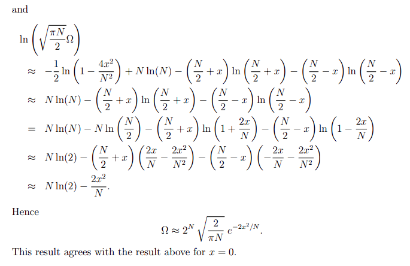
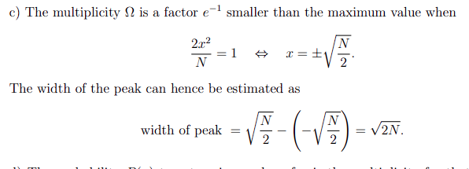
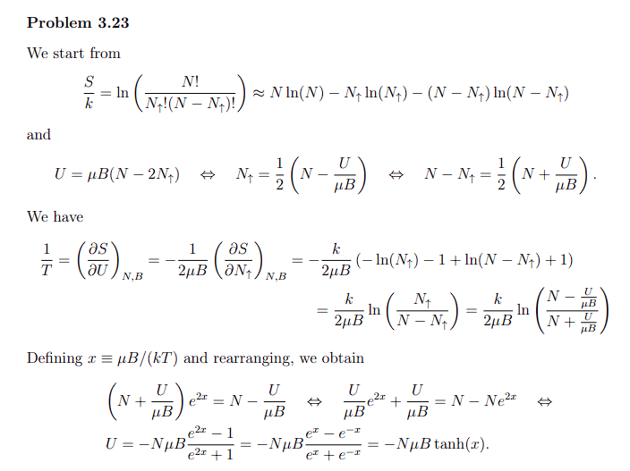
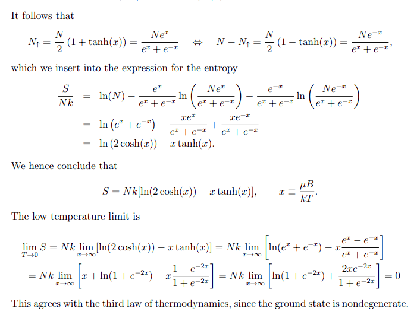
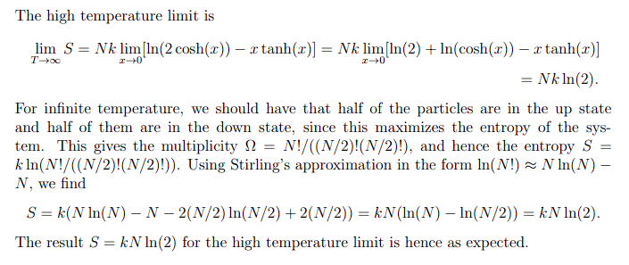

[HOME](/source/index.rst)

(twostateparamagnet)=
# Two State Paramagnet

The height of any function is just its value at a specific point.

When have a system where the multiplicity function is very sharply peaked about $N_{\arrowup} = N/2$ folow this:

```{figure} ../../../figures/TwoStateParamagnet/image.png
:name: prblslvntwsttprrmgnt









```

++++
(twsttdrvt_entropy)=
## Entropy - Two state Paramagnet

:::{note}
Full dereveation of Entropy as 
a function of Temperature. Derived from $\frac{S}{k}$
:::

:::{subfigure}






:::
