[HOME](TOC)

# Partition & Boltzmann's Function

The ratio of [probabilities](ratio) can be used with only the difference in energy and the temperature. It only consists of the boltzmann factors from the energy state.

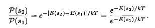

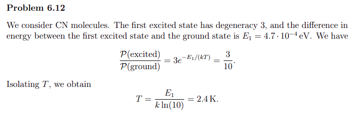

+++

## Problems and answers

- 'ProblemsE.pdf' and 'AnswersE.pdf' problem E1
- 'ProblemsD.pdf' and 'AnswersD.pdf' problem 6.16

### Average energy

Proving the average energy from the partition function, when a system is in equilibrium with a resevoir at temperature T.

- 'AnswersD.pdf' problem 6.16

The average energy is the sum of all the different state energies weighted by their probabilities and for a symbolic deriviation use the following:

```python
from PartitionFunctions import PF_average_energy, PF_heat_capacity

PF_average_energy(test_func,beta)

PF_heat_capacity(test_func,beta)
```

> **!!Beware!! when using these functions be sure that you are using the correct assumptions. The script cannot make assumptions based on things given in the text, so it is necessary to incorporate assumptions or simplifications into your expression before using it**

:::{warning}
some functions are almost deprecated

Read through the function before using them
:::

This can be done by incorporating predicates when defining symbols as an example:

```python

from PartitionFunctions import PF_average_energy, PF_heat_capacity

from sympy import symbols

x, y, z = symbols('x y z', positive = True ) # for positive values - useful for constants
```

For the easiest application of this use the `simplify` function from the `sympy` module to make the initial expression easier to manipulate manually and then rewrite them into your own calculation script. If `simplify` does not cut it, try with `collect`, and if it still does not work... **Good luck**

- 'AnswersD.pdf' Last 4 problems gives a not so good description of how to handle manipulations like these.

++++

### Fraction of upper state / lower state

When determining the fraction of probabilities, beware of the question describtion. Is it asking for the number of particles of higher energy per particles of lower energy particles or is it asking for the percentage of particles in the specific state.
Either way use `Frac_partition_funcs(E_difference, T)`{l=python} from the `PartitionFunctions`{l=python} module.

### Single harmonic Oscillator

When working with a single oscillator it is the same approach as for anything else. It just takes advantage of the fact that the partition function does not change depending on the energy, and therefor is a very nice place to start when calculating the average energy of a system, and then using that average to get the heat capacity. When working symbolically with this please refer to the module `PartitionFunctions` and use the functions

```python
from PartitionFunctions import PF_average_energy, PF_heat_capacity

PF_average_energy(test_func,beta)

PF_heat_capacity(test_func,beta)
```

I would recommend using the latter of the two functions, because it makes use of the average energy function and there displays the following results:

- Average energy in terms of $\beta$
- Total energy for N particles in terms of $\beta$
- Total energy for N particles in terms of $\frac{1}{k \cdot T}$
- Heat Capacity at constant volume in terms of $T$
- Heat capacity evaluated at both $T \rightarrow 0$ and $T \rightarrow \infin$

> **Be aware of $\beta$ and make sure that it is written properly into the first function, so it is not confused as $\frac{h f}{\beta}$ which would be equal to $h f k T$ and not $\frac{hf}{kT}$ as $\beta = \frac{1}{kT}$**

### molecular clouds

- refer to 'AnswersD.pdf' problem 6.12 when in equilibrium
  
Remember to change use the correct boltzmann constant.

## Another dereviation - Energy as a function of $1/kT$

Proving [this](#nrgasfunc) 

{#nrgasfunc}
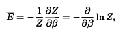 

{#nrgaspart}
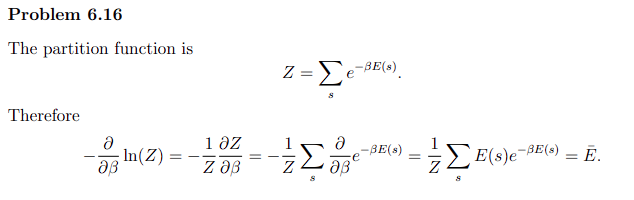

++++

## [GP][gl] for parttion function

:::{warning} 
[GP][gl]


[] - ToDo make dropdown warning for another one
:::

Using the `PartitionFunction` module to build the partition function non symbolically.

:::{code-block}python
from PartitionFunctions import partition_func_template, create_arrays, energyMatrix

nmbr_of_prtcls = 2

ngtv_nrgi = 2

nmbr_of_stts = 3

nrgs = energyMatrix(nmbr_of_stts, ngtv_nrgi, nmbr_of_prtcls)

res = partition_func_template(e_input=nrgs)

:::

***Almost everything one needs when working with partition functions***

when creating a partition function for a system please use the following module and functions:

The function [`partition_func_template`](/build/html/apidocs/SttPhscsPckg) has parameters other than `e_input`, but they are pretty outdated.

:::{subfigure}

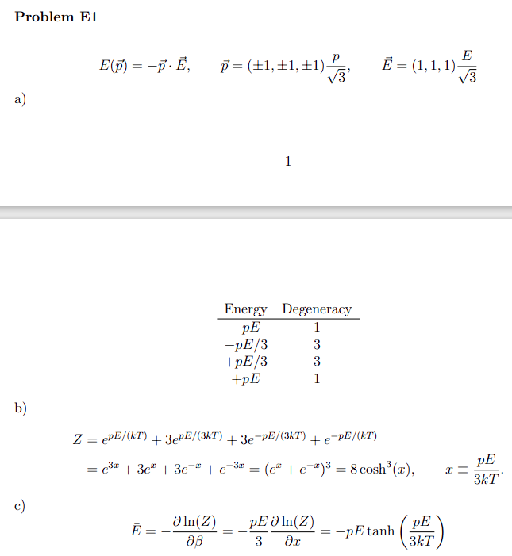

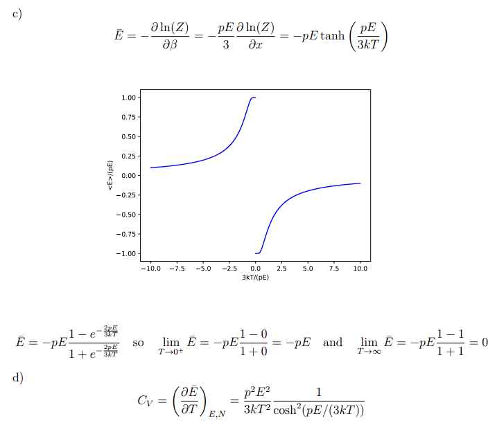

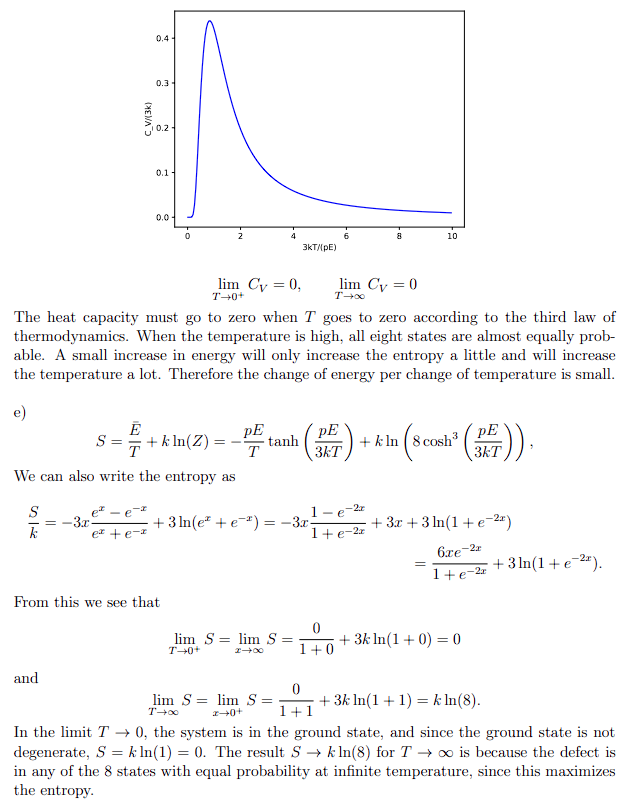
[pe1]
:::

:::{subfigure}

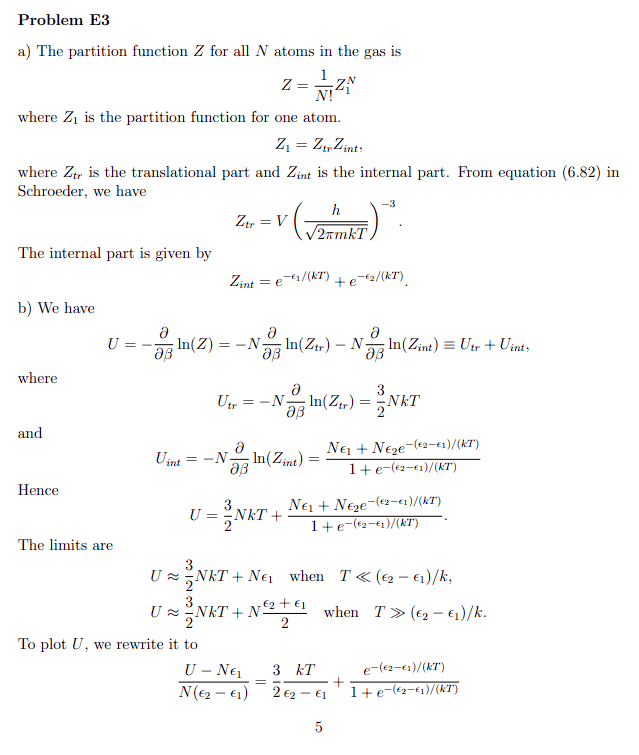

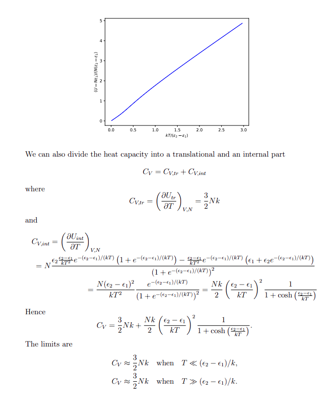

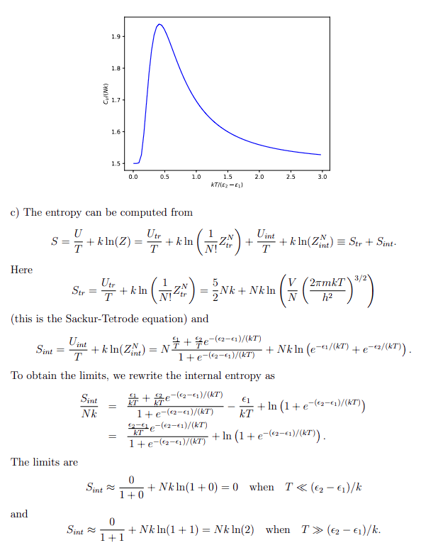

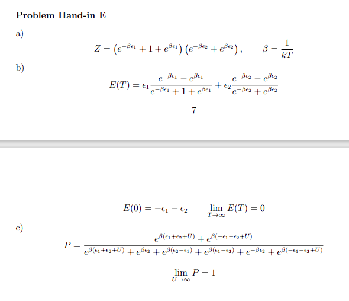
:::

[gl]: (Glossary)
