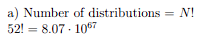

[HOME](/source/index.rst)

# Combinatorial Mathematics

This section will describe the math (if any) hat is used.

```{warning}
Maths and Physics together can hurt you.
Please do be carefull and have snacks and a blancket ready.
```

|Quick problems | Quick Maths |
|-------- | :------:|
|Number of distributions in a deck of cards | |


(binom)=
## Binomial coefficient

````{important} ***The binomial coefficient***

```{math}
:label: bincoef

\binom{N}{m} = \frac{N!}{m!(N-m)!}
```
````

## Important limits in $ln$ and $e^x$

```{list-table}
    - Problems
*   - Answers
    -
*   -

```

Apperently there is something called el hospitals rule... 
probably because of the many hospitals that where involved with the man whom made it up.

- *mean value theorem* - if f:[a,b] -> R is continuous on [a,b] and differentiable on (a,b), then there exists a point c $\in$ (a,b) where $f'( c) = \frac{f(b)-f(a)}{b-a}$
	- *Rolle's thm* - f(a)=f(b) -> f'( c)=0
	- if f'(x) = 0 for all x in A, then f(x) = k for some constant k
- if f and g are differentiable functions on an interval A and satisfy f'(x) = g'(x) for all x $\in$ A, then f(x) = g(x) + k for some constant k
- *generalized mean value theorem* - if f and g are continuous on the closed interval [a,b] and differentiable on the open interval (a,b), then there exists a point c $\in (a,b)$ where \|f(b)-f(a)\|g'( c) = \|g(b)-g(a)\|f'( c).  If g' is never 0 on (a,b), then can be restated $\frac{f'( c)}{g'( c)} = \frac{f(b)-f(a)}{g(b)-g(a)}$
- given g: A -> R and a limit point c of A, we say that *$lim_{x \to c} g(x) = \infty$* if, for every M > 0, there exists a $\delta$> 0 such that whenever 0 < \|x-c\| < $\delta$ it follows that g(x) ≥ M
- *L'Hospital's Rule: 0/0* - let f and g be continuous on an interval containing a, and assume f and g are differentiable on this interval with the possible exception of the point a.  If f(a) = g(a) = 0 and g'(x) ≠ 0 for all x ≠ a, then $lim_{x \to a} \frac{f'(x)}{g'(x)} = L \implies lim_{x \to a} \frac{f'(x)}{g'(x)} = L$
- *L'Hospital's Rule: $\infty / \infty$* - assume f and g are differentiable on (a,b)  and g'(x) ≠ 0 for all x in (a,b).  If $lim_{x \to a} g(x) = \infty $, then $lim_{x \to a} \frac{f'(x)}{g'(x)} = L \implies lim_{x \to a} \frac{f'(x)}{g'(x)} = L$ 

```{note}
Taken from [csinva.io][d1]

```


[d1]: delete unimportant stuff when online https://github.com/csinva/csinva.github.io/blob/master/readme.md