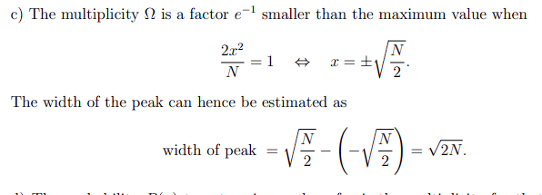

[HOME](../../index)

(manipul)=
# Manipulation of natural expressions

(manipulexp)=
## Usefull prewritten examples

:::{subfigures}
:subcaptions: below

**_](../../../figures/Manipulation/image-4.png)

:::
